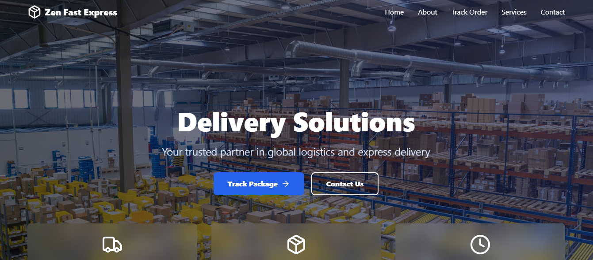
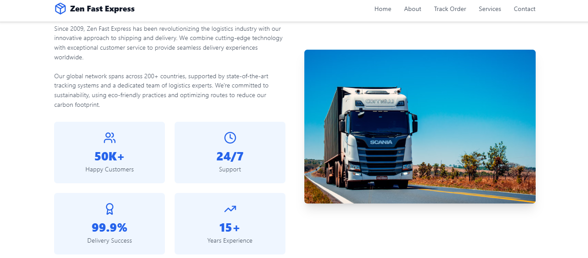
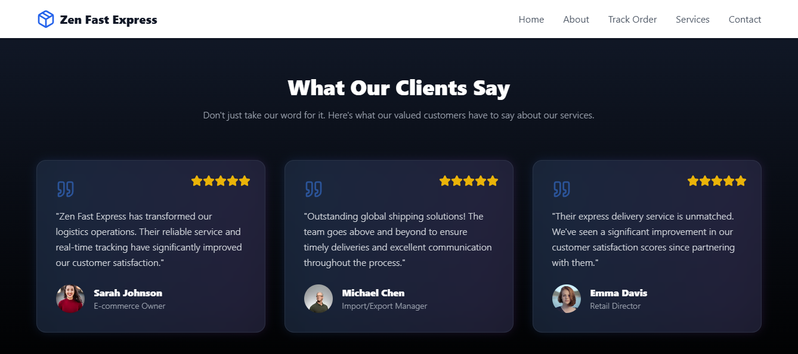

# 🚀 Zen Fast Express  

  

Welcome to **Zen Fast Express** – a modern, responsive website for effortless order tracking, service exploration, and customer communication!  

## 🌟 Features  
- 🏠 **Home Page**: An engaging and informative landing page.  
- 💡 **About Section**: Insight into our mission and services.  
- 🚚 **Track Order**: Easily track the status of your orders.  
- 🛠️ **Services**: Discover our wide range of offerings.  
- 📞 **Contact Us**: Get in touch via our interactive contact form.  
- 🌐 **Footer**: Connect with us on social media and beyond.  

## 🛠️ Tech Stack  
- ⚛️ **React.js**  
- 🎨 **Tailwind CSS**  
- 🖥️ **HTML5 & CSS3**  
- 🌐 **JavaScript**  

---

## 🎬 Demo  
Check out the live demo here: [Zen Fast Express Live](https://example.com)  

  
 
 
---

## 🚀 Getting Started  

Follow these steps to set up the project locally:  


### 🛠 Installation  
1. Clone this repository:  
   ```bash  
   git clone https://github.com/your-username/zen-fast-express.git  
   ```  

2. Navigate to the project directory:  
   ```bash  
   cd zen-fast-express  
   ```  

3. Install dependencies:  
   ```bash  
   npm install  
   ```  

4. Run the development server:  
   ```bash  
   npm start  
   ```  
   Open [http://localhost:3000](http://localhost:3000) to view it in your browser.  

---

## 📁 Project Structure  

```  
zen-fast-express/  
├── public/           # Static files  
├── src/              # Source code  
│   ├── components/   # Reusable components  
│   ├── pages/        # Pages (Home, About, etc.)  
│   ├── App.js        # Main app component  
│   ├── index.js      # Entry point  
│   └── styles/       # Tailwind CSS configuration  
├── package.json      # Dependencies and scripts  
└── README.md         # Documentation  
```  

---

## ✨ Preview  

### 📌 Home Page  
 

  

---

## 🤝 Contributing  
We ❤️ contributions!  
1. Fork the repository.  
2. Create a new branch: `git checkout -b feature/your-feature-name`.  
3. Commit your changes: `git commit -m "Add some feature"`.  
4. Push to the branch: `git push origin feature/your-feature-name`.  
5. Submit a pull request.  

---

## 📞 Contact  

Have questions or feedback?  
🌐 **Website**: [ISHAN](https://ishand.netlify.app)  

---

### ©️ Zen Fast Express  
